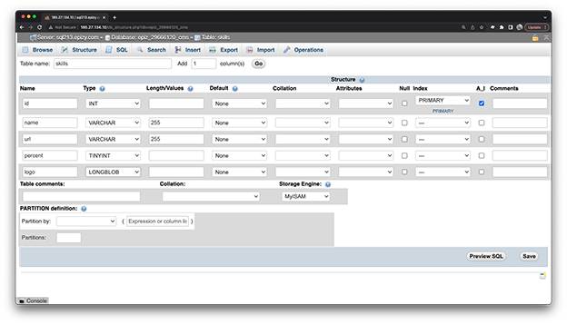

# Skills Module for PHP CMS

> [!Warning]  
> This repo is a work in progress!

This is a basic skills module basaed on the PHP CMS avalable in my [php-cms](https://github.com/codeadamca/php-cms) repo.

## Database

1. Create a skills table:

    

2. Modify dashboard.php.
3. Add list, add, and edit to the amin. 
4. Add index.php changes to the frontend.

***

## Repo Resources

* [php-cms](https://github.com/codeadamca/php-cms)
* [PHP](https://www.php.net/)

